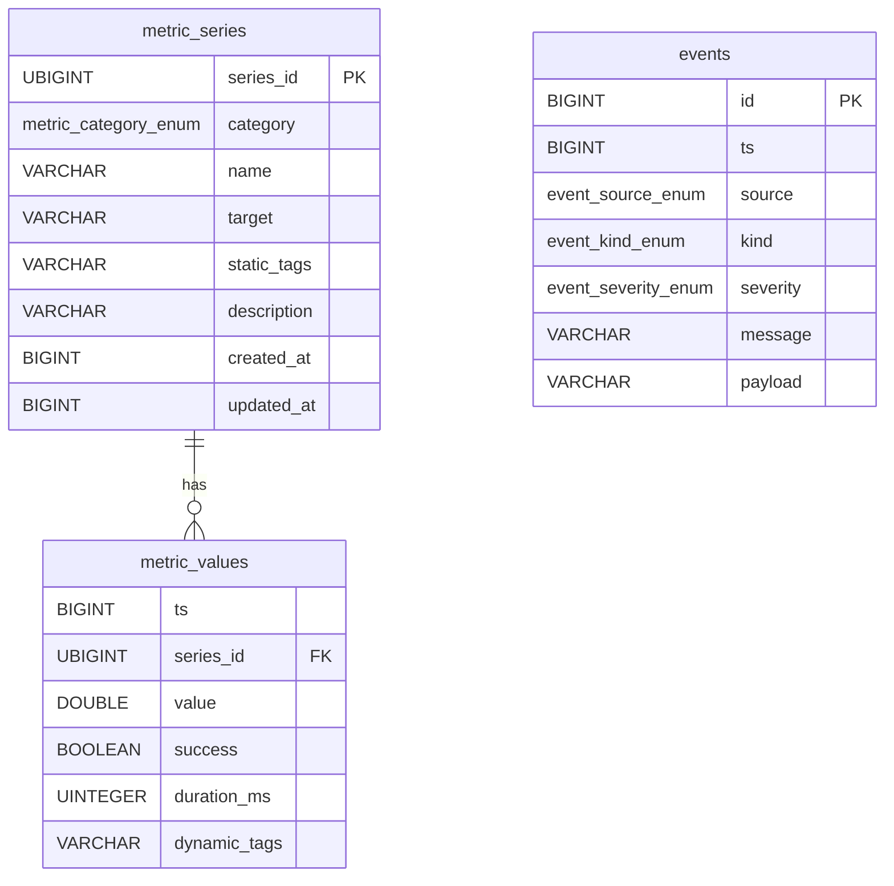

# Database Schema

Oculus uses DuckDB for embedded OLAP storage with a Series-Values separation design.

## Architecture



## Tables

### metric_series (Dimension Table)

Stores static metadata that identifies unique metric series. Deduplicated via `series_id`.

| Column | Type | Constraint | Description |
|--------|------|------------|-------------|
| series_id | UBIGINT | PRIMARY KEY | xxhash64(category\|name\|target\|sorted_static_tags) |
| category | metric_category_enum | NOT NULL | Metric classification |
| name | VARCHAR | NOT NULL | Metric name (e.g., "latency") |
| target | VARCHAR | NOT NULL | Target identifier (e.g., "127.0.0.1:6379") |
| static_tags | VARCHAR | DEFAULT '{}' | JSON-encoded identity tags |
| description | VARCHAR | NULL | Human-readable description |
| created_at | BIGINT | NOT NULL | First seen (microseconds since epoch) |
| updated_at | BIGINT | NOT NULL | Last updated (microseconds since epoch) |

### metric_values (Data Table)

Stores time-series numeric data points linked to series via `series_id`.

| Column | Type | Constraint | Description |
|--------|------|------------|-------------|
| ts | BIGINT | NOT NULL | Timestamp (microseconds since epoch) |
| series_id | UBIGINT | NOT NULL | Reference to metric_series |
| value | DOUBLE | NOT NULL | Numeric value |
| success | BOOLEAN | NOT NULL DEFAULT TRUE | Whether collection succeeded |
| duration_ms | UINTEGER | NULL | Collection duration in milliseconds |
| dynamic_tags | VARCHAR | DEFAULT '{}' | JSON-encoded context tags |

### events

Structured event records for alerts, errors, and audit logs.

| Column | Type | Constraint | Description |
|--------|------|------------|-------------|
| id | BIGINT | PRIMARY KEY | Auto-increment via `events_id_seq` |
| ts | BIGINT | NOT NULL | Timestamp (microseconds since epoch) |
| source | event_source_enum | NOT NULL | Event origin |
| kind | event_kind_enum | NOT NULL | Event classification |
| severity | event_severity_enum | NOT NULL | Priority level |
| message | VARCHAR | NOT NULL | Human-readable description |
| payload | VARCHAR | DEFAULT '{}' | JSON-encoded context |

## Custom Types

### metric_category_enum

```sql
CREATE TYPE metric_category_enum AS ENUM (
    'network.tcp', 'network.ping', 'network.http',
    'crypto', 'polymarket', 'stock', 'custom'
);
```

### event_source_enum

```sql
CREATE TYPE event_source_enum AS ENUM (
    'collector.registry', 'collector.network.tcp', 'collector.network.ping',
    'collector.network.http', 'rule.engine', 'system', 'other'
);
```

### event_kind_enum

```sql
CREATE TYPE event_kind_enum AS ENUM ('alert', 'error', 'system', 'audit');
```

| Value | Description |
|-------|-------------|
| `alert` | Rule-triggered notification |
| `error` | Collector or system error |
| `system` | Internal system event |
| `audit` | Audit trail entry |

### event_severity_enum

```sql
CREATE TYPE event_severity_enum AS ENUM ('debug', 'info', 'warn', 'error', 'critical');
```

| Value | Description |
|-------|-------------|
| `debug` | Verbose diagnostic info |
| `info` | Normal operation |
| `warn` | Potential issue |
| `error` | Error requiring investigation |
| `critical` | Severe failure requiring immediate action |

## Query Examples

### Recent metrics by category

```sql
SELECT s.name, s.target, v.ts, v.value, v.success
FROM metric_values v
JOIN metric_series s ON v.series_id = s.series_id
WHERE s.category = 'network.tcp'
  AND v.ts > (EXTRACT(EPOCH FROM NOW()) * 1000000) - 3600000000
ORDER BY v.ts DESC
LIMIT 100;
```

### Events by severity

```sql
SELECT ts, source, kind, message
FROM events
WHERE severity IN ('error', 'critical')
ORDER BY ts DESC;
```

### Metrics with dynamic tags

```sql
SELECT s.name, v.value, v.dynamic_tags
FROM metric_values v
JOIN metric_series s ON v.series_id = s.series_id
WHERE v.dynamic_tags IS NOT NULL
  AND json_extract_string(v.dynamic_tags, '$.status_code') = '200';
```

## Data Retention

Default retention: **7 days** (configurable via `StorageAdmin`)

```sql
DELETE FROM metric_values WHERE ts < ?;  -- cutoff in microseconds
DELETE FROM events WHERE ts < ?;
```
