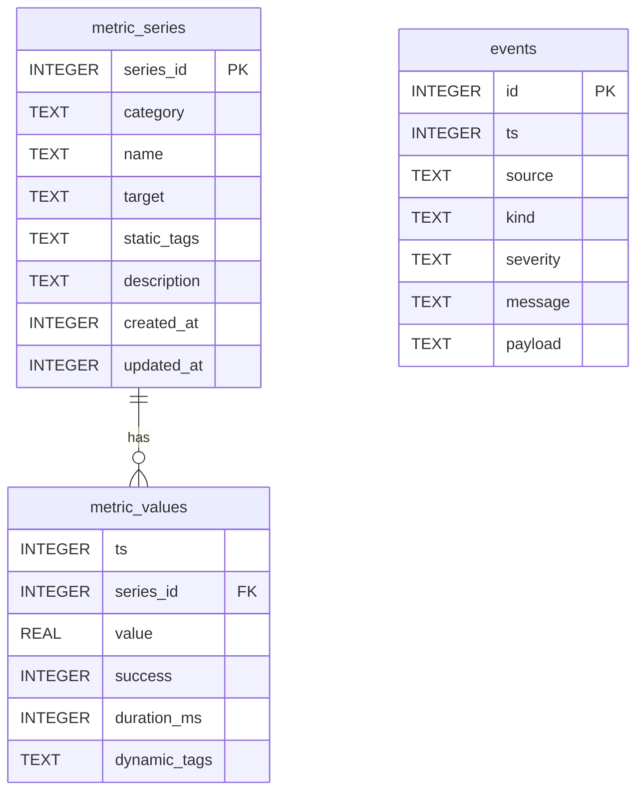

# Database Schema

Oculus uses SQLite for embedded storage with a Series-Values separation design.

## Architecture



## Tables

### metric_series (Dimension Table)

Stores static metadata that identifies unique metric series. Deduplicated via `series_id`.

| Column      | Type    | Constraint   | Description                                          |
| ----------- | ------- | ------------ | ---------------------------------------------------- |
| series_id   | INTEGER | PRIMARY KEY  | xxhash64(category\|name\|target\|sorted_static_tags) |
| category    | TEXT    | NOT NULL     | Metric classification (CHECK constraint)             |
| name        | TEXT    | NOT NULL     | Metric name (e.g., "latency")                        |
| target      | TEXT    | NOT NULL     | Target identifier (e.g., "127.0.0.1:6379")           |
| static_tags | TEXT    | DEFAULT '{}' | JSON-encoded identity tags                           |
| description | TEXT    | NULL         | Human-readable description                           |
| created_at  | INTEGER | NOT NULL     | First seen (microseconds since epoch)                |
| updated_at  | INTEGER | NOT NULL     | Last updated (microseconds since epoch)              |

### metric_values (Data Table)

Stores time-series numeric data points linked to series via `series_id`.

| Column       | Type    | Constraint         | Description                           |
| ------------ | ------- | ------------------ | ------------------------------------- |
| ts           | INTEGER | NOT NULL           | Timestamp (microseconds since epoch)  |
| series_id    | INTEGER | NOT NULL           | Reference to metric_series            |
| value        | REAL    | NOT NULL           | Numeric value                         |
| unit         | TEXT    | NULL               | Unit of measurement (e.g., "ms")      |
| success      | INTEGER | NOT NULL DEFAULT 1 | Whether collection succeeded (0 or 1) |
| duration_ms  | INTEGER | NULL               | Collection duration in milliseconds   |
| dynamic_tags | TEXT    | DEFAULT '{}'       | JSON-encoded context tags             |

### events

Structured event records for alerts, errors, and audit logs.

| Column   | Type    | Constraint                | Description                          |
| -------- | ------- | ------------------------- | ------------------------------------ |
| id       | INTEGER | PRIMARY KEY AUTOINCREMENT | Auto-increment event ID              |
| ts       | INTEGER | NOT NULL                  | Timestamp (microseconds since epoch) |
| source   | TEXT    | NOT NULL                  | Event origin (CHECK constraint)      |
| kind     | TEXT    | NOT NULL                  | Event classification                 |
| severity | TEXT    | NOT NULL                  | Priority level                       |
| message  | TEXT    | NOT NULL                  | Human-readable description           |
| payload  | TEXT    | DEFAULT '{}'              | JSON-encoded context                 |

## Enum Values (CHECK Constraints)

### category values

```sql
CHECK(category IN (
    'network.tcp', 'network.ping', 'network.http',
    'crypto', 'polymarket', 'stock', 'custom'
))
```

### event source values

```sql
CHECK(source IN (
    'collector.network.tcp', 'collector.network.ping', 'collector.network.http',
    'rule.engine', 'system'
))
```

### event kind values

| Value    | Description                 |
| -------- | --------------------------- |
| `alert`  | Rule-triggered notification |
| `error`  | Collector or system error   |
| `system` | Internal system event       |
| `audit`  | Audit trail entry           |

### event severity values

| Value      | Description                               |
| ---------- | ----------------------------------------- |
| `debug`    | Verbose diagnostic info                   |
| `info`     | Normal operation                          |
| `warn`     | Potential issue                           |
| `error`    | Error requiring investigation             |
| `critical` | Severe failure requiring immediate action |

## Query Examples

### Recent metrics by category

```sql
SELECT s.name, s.target, v.ts, v.value, v.success
FROM metric_values v
JOIN metric_series s ON v.series_id = s.series_id
WHERE s.category = 'network.tcp'
  AND v.ts > (strftime('%s', 'now') * 1000000) - 3600000000
ORDER BY v.ts DESC
LIMIT 100;
```

### Events by severity

```sql
SELECT ts, source, kind, message
FROM events
WHERE severity IN ('error', 'critical')
ORDER BY ts DESC;
```

### Metrics with dynamic tags

```sql
SELECT s.name, v.value, v.dynamic_tags
FROM metric_values v
JOIN metric_series s ON v.series_id = s.series_id
WHERE v.dynamic_tags IS NOT NULL
  AND json_extract(v.dynamic_tags, '$.status_code') = '200';
```

## Data Retention

Default retention: **7 days** (configurable via `StorageAdmin`)

```sql
DELETE FROM metric_values WHERE ts < ?;  -- cutoff in microseconds
DELETE FROM events WHERE ts < ?;
```
